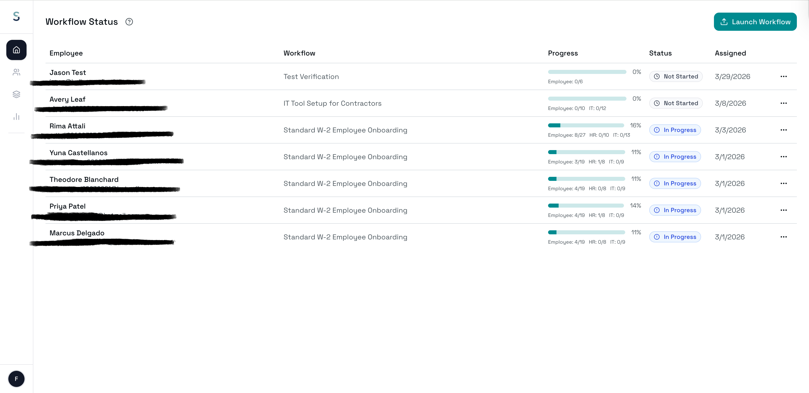
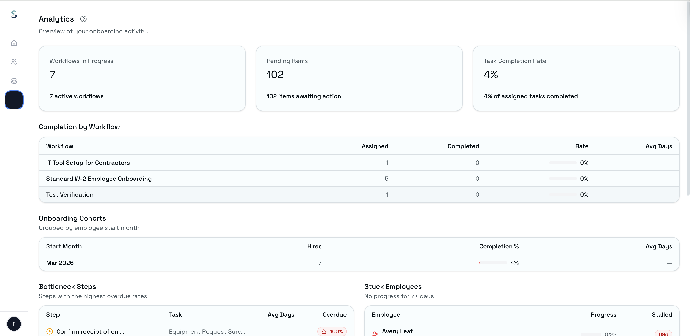
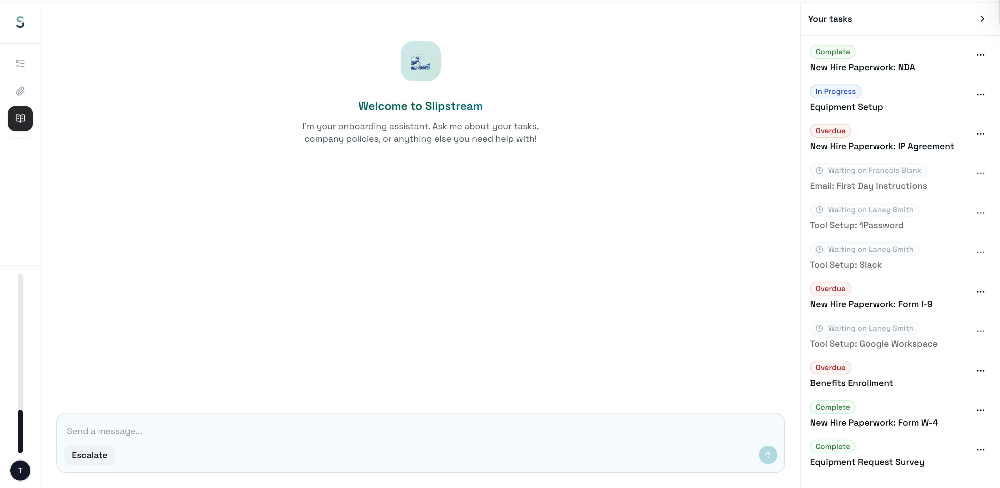
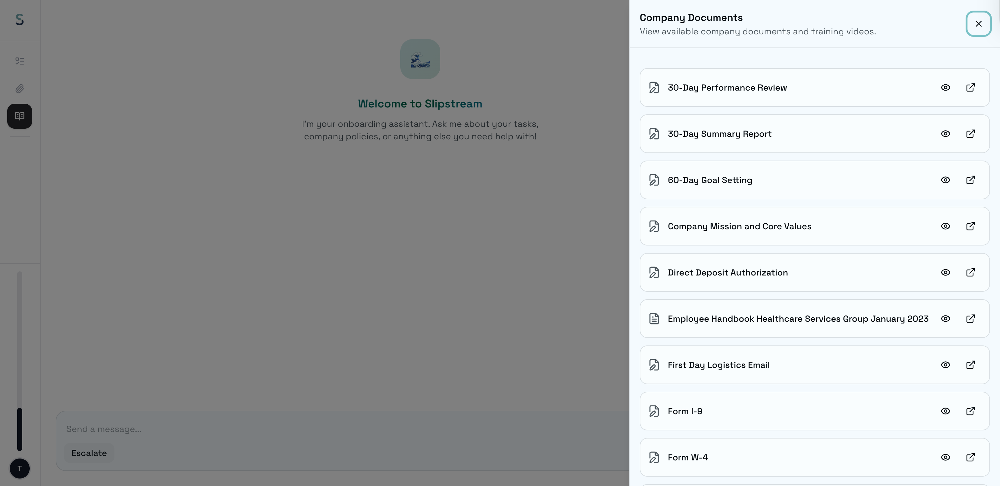

# AI Onboarding Workflow System


An AI-assisted onboarding platform designed to streamline employee onboarding through workflow automation, role-based task management, and conversational guidance.

The system supports onboarding workflows for employees, HR teams, managers, and platform administrators through a multi-dashboard architecture. Features include workflow orchestration, task dependency management, escalation handling, document management, and real-time onboarding progress tracking.

This project is based on work completed during my internship at an early-stage startup focused on AI-powered enterprise onboarding systems. The repository presented here is a sanitized portfolio version intended for demonstration and educational purposes.

---

# Overview

Traditional onboarding processes are often fragmented across spreadsheets, emails, PDFs, HR systems, and manual follow-ups. This project explores how AI-assisted workflows and centralized task orchestration can improve onboarding visibility, coordination, and completion tracking across multiple stakeholders.

The platform combines workflow automation, role-based access control, and conversational interfaces to support onboarding processes for employees, HR teams, managers, and platform administrators.

---

# Core Features

## AI-Assisted Employee Onboarding
- Conversational onboarding experience through an AI-guided chat interface
- Real-time streaming responses for interactive onboarding support
- Personalized onboarding workflows and task progression

## Workflow Orchestration
- Multi-step onboarding workflows with dependency management
- Reusable workflow templates and task libraries
- Task sequencing and blocking logic
- Workflow assignment and progress tracking

## Role-Based Access System
The platform supports multiple user roles with separate dashboards and permissions:

| Role | Functionality |
|---|---|
| Employee | Complete onboarding tasks and interact with onboarding assistant |
| HR/Admin | Manage workflows, employees, forms, and onboarding progress |
| Stakeholder/Manager | Complete assigned onboarding steps and monitor workflows |
| Platform Admin | Manage multi-company infrastructure and platform-level operations |

## Task & Progress Management
- Real-time onboarding progress tracking
- Due date and overdue status indicators
- Escalation handling for blocked onboarding steps
- Workflow completion monitoring

## Document & Knowledge Management
- Company document management
- Form template handling
- Knowledge base integration
- Training resource organization

## Analytics & Audit Features
- Workflow completion analytics
- Audit logging
- Employee onboarding tracking
- Administrative monitoring dashboards

---

# System Design

The platform follows a multi-dashboard enterprise SaaS architecture built around workflow coordination and onboarding automation.

## High-Level Architecture

```text
                    ┌────────────────────┐
                    │  Admin Dashboard   │
                    └────────────────────┘
                              │
                              │
┌────────────────────┐        │        ┌────────────────────┐
│ Employee Dashboard │────Workflow────│ Stakeholder Portal │
└────────────────────┘      Engine    └────────────────────┘
                              │
                              │
                    ┌────────────────────┐
                    │ Supabase Backend   │
                    └────────────────────┘
```

## Key Architectural Concepts

### Workflow System
Employees can be assigned multiple onboarding workflows. Each workflow contains tasks, and each task contains multiple actionable steps.

### Dependency Resolution
Tasks may depend on the completion of previous tasks before becoming available.

### Escalation Handling
Blocked onboarding steps can be escalated to relevant stakeholders or administrators.

### Multi-Tenant Structure
The platform supports multiple organizations with role-scoped permissions and administrative separation.

---
# Key Focus Areas

- Workflow orchestration and onboarding automation
- Multi-role onboarding coordination
- Role-based access systems (RBAC)
- Workflow dependency management
- Product usability and operational workflow analysis
- Enterprise onboarding process optimization
- Administrative workflow visibility and escalation handling

# Technical Stack

| Category | Technologies |
|---|---|
| Frontend | Next.js, React, TypeScript |
| Styling | Tailwind CSS, shadcn/ui |
| Backend / API Layer | Next.js API routes, server-side proxy routes |
| Database & Auth | Supabase, PostgreSQL, Supabase Auth |
| Real-Time Features | Supabase Realtime, Server-Sent Events (SSE) |
| AI Integration | External AI agent backend, streaming chat interface |
| Document & Form Handling | Supabase Storage, PDF/document workflows |
| Deployment | Vercel |

---

# My Contributions

My work on this project focused on onboarding workflow systems, workflow validation, product usability analysis, and operational workflow optimization across multi-role onboarding environments.

Contributions included:

- Reviewing onboarding workflows across employee, HR, stakeholder, and platform admin dashboards to identify friction points and workflow inefficiencies

- Analyzing workflow edge cases, dependency conflicts, and onboarding bottlenecks across complex multi-step task sequences

- Evaluating task dependency sequencing, workflow progression behavior, and escalation routing logic to improve onboarding coordination and completion visibility

- Supporting workflow design discussions related to role-based onboarding experiences, task assignment structures, and operational scalability

- Identifying UX inconsistencies and platform usability issues across onboarding and administrative interfaces

- Reporting structured implementation findings, workflow issues, and product improvement recommendations through issue tracking systems

- Assisting with QA validation and end-to-end workflow testing across onboarding, workflow management, and administrative operations

- Contributing to system-level review processes focused on onboarding orchestration, workflow visibility, and cross-functional coordination

---

# Workflow Concepts

The onboarding system was designed around several enterprise workflow concepts:

- Workflow sequencing
- Role-aware task assignment
- Access-group-based dashboards
- Escalation routing
- Multi-step onboarding coordination
- Administrative workflow management
- Real-time onboarding visibility

---

# Repository Structure

```text
architecture/   -> system architecture diagrams and workflow design documentation
docs/           -> QA testing methodology, onboarding edge cases, workflow validation, and product observations
scripts/        -> sanitized workflow validation and onboarding simulation scripts
assets/         -> onboarding dashboard and platform screenshots
```
---

# Screenshots

## Workflow Status Dashboard

Tracks onboarding workflow progress across employees, workflows, task dependencies, and completion states.



---

## Onboarding Analytics Dashboard

Provides onboarding analytics, workflow completion visibility, bottleneck detection, and operational tracking across onboarding cohorts.



---

## Employee Onboarding Chat Interface

AI-assisted onboarding interface combining conversational guidance with real-time onboarding task coordination.



---

## Document Management Panel

Centralized onboarding document and knowledge management system for employee onboarding workflows.



---

## Platform Admin Dashboard

Administrative interface for platform-level onboarding operations, company management, and onboarding visibility.


---

# Future Improvements

Potential future enhancements include:
- Advanced workflow analytics
- AI-generated onboarding recommendations
- Workflow visualization tools
- Expanded audit and compliance tracking
- Cross-platform integrations
- Workflow simulation and testing environments

---

# Disclaimer

This repository is a sanitized portfolio adaptation based on work completed during an internship experience. Sensitive infrastructure details, credentials, production configurations, and proprietary internal implementation details have been removed or generalized for demonstration purposes.
