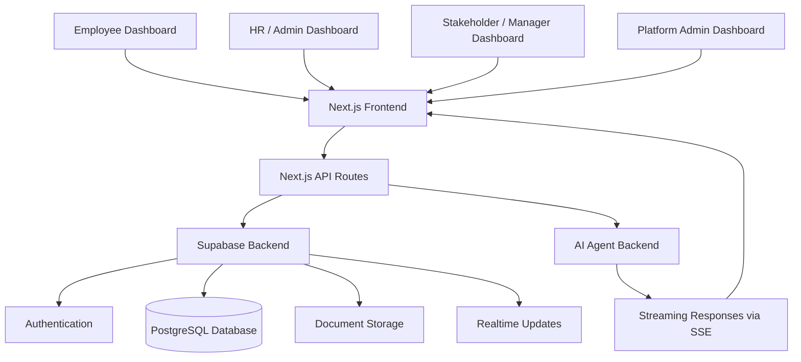
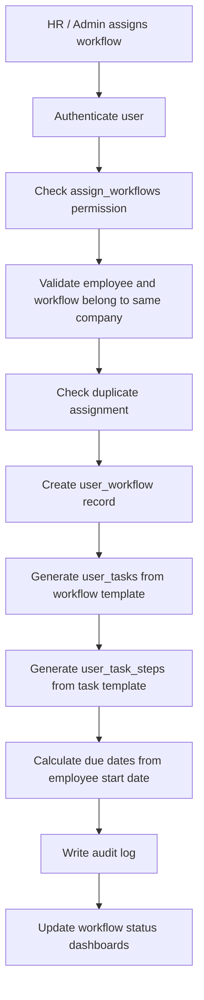
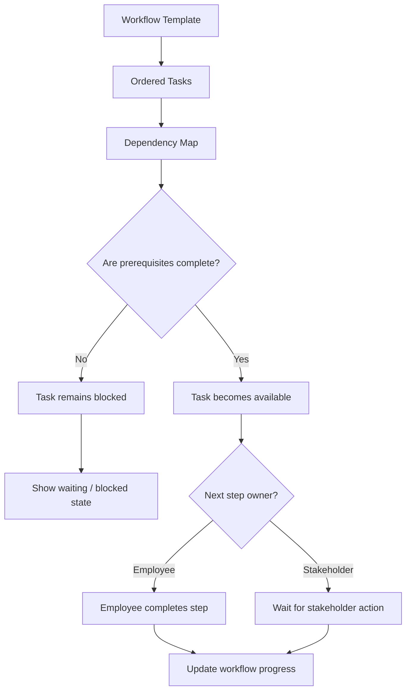
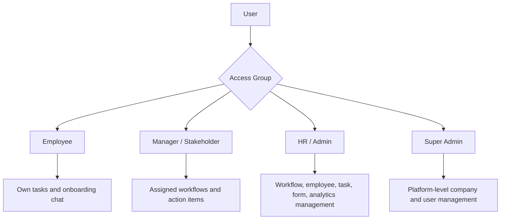
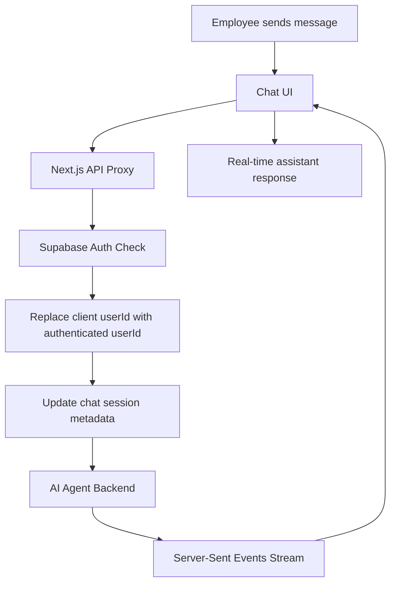
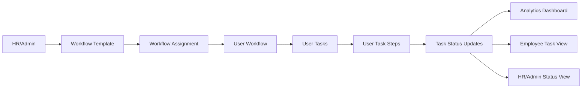

# System Architecture Diagrams

This file contains simplified system diagrams for the AI Onboarding Workflow System.

---

# High-Level System Architecture

---

# Workflow Assignment Flow

---

# Workflow Sequencing Logic

---

# Role-Based Access Model

---

# Agent Streaming Flow

---

# Data Flow Overview

